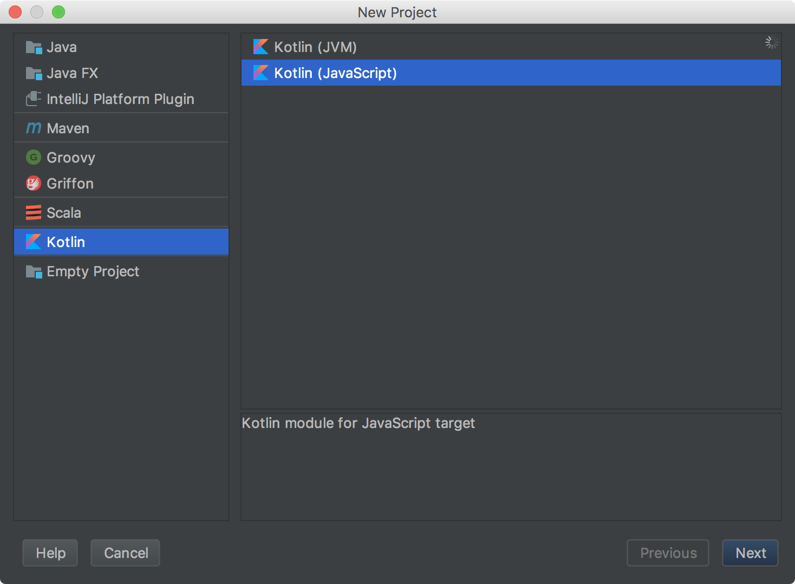
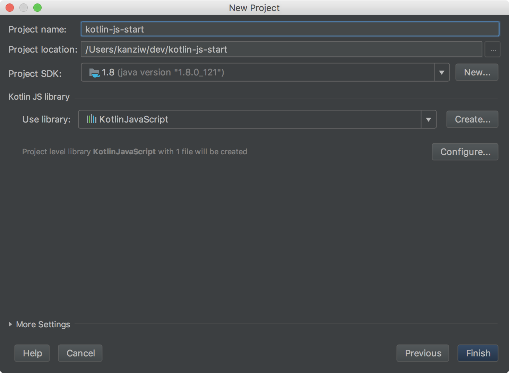
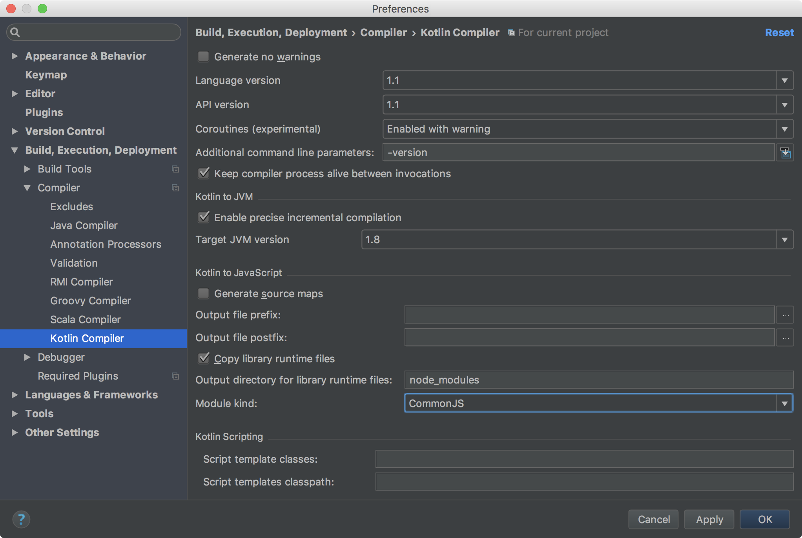
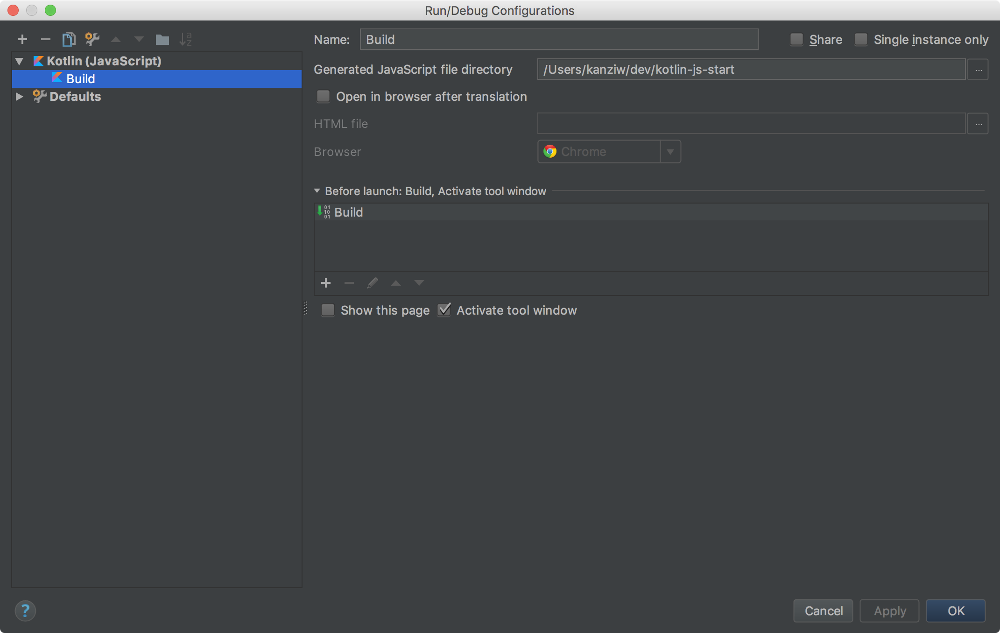

# Kotlin-Js Start

## Pre-Installation

* [IntelliJ](https://www.jetbrains.com/idea/download/)
* [JDK](http://www.oracle.com/technetwork/java/javase/downloads/index-jsp-138363.html) >= 1.8


## Start IntelliJ Project






## Hello, Kotlin

* hello.kt

```kotlin
fun main(args: Array<String>) {
    println("Hello Kotlin")
}
```


* IntelliJ 설정






빌드 하면 프로젝트 최상위 디렉터리에 `kotlin-js-start.js` 파일이 생성되며, `node` 명령어로 실행할 수 있다.

```shell
$ npm run test

> kotlin-js-start@1.0.0 test /Users/kanziw/dev/kotlin-js-start
> node kotlin-js-start.js

Hello Kotlin
```


## Import 실습 - lodash

* hello.kt

```kotlin
external interface Lodash {
    fun isString(obj: Any = definedExternally): Lodash
    fun isNull(obj: Any = definedExternally): Lodash
}

@JsModule("lodash")
external val lodash: Lodash

fun main(args: Array<String>) {
    println("Hello Kotlin")
    println(lodash.isString("STRING").toString())
    println(lodash.isNull("STRING").toString())
}
```

* 결과

```shell
$ npm run test

> kotlin-js-start@1.0.0 test /Users/kanziw/dev/kotlin-js-start
> node kotlin-js-start.js

Hello Kotlin
true
false
```


## Import 실습 - express

* hello.kt

```kotlin
external interface Lodash {
    fun isString(obj: Any = definedExternally): Lodash
    fun isNull(obj: Any = definedExternally): Lodash
}

@JsModule("lodash")
external val lodash: Lodash

external interface Express {
    fun get(address: String, callback: Any): Express
    fun listen(port: Int)
}

@JsModule("express")
external fun express(): Express

external interface ExpressResponse {
    fun send(string: String): Unit
}

fun main(args: Array<String>) {
    println("Hello Kotlin")
    println(lodash.isString("STRING").toString())
    println(lodash.isNull("STRING").toString())

    val app = express()

    app.get("/") { req: Any, res: ExpressResponse -> res.send("Hello, Express.") }

    println("Starting server, PORT: 3762")
    app.listen(3762)
}
```

* Server

```shell
$ npm run test

> kotlin-js-start@1.0.0 test /Users/kanziw/dev/kotlin-js-start
> node kotlin-js-start.js

Hello Kotlin
true
false
Starting server, PORT: 3762
```

* Curl

```shell
$ curl localhost:3762
Hello, Express.
```


## coroutine - yield basic

* hello.kt

```kotlin
import kotlin.coroutines.experimental.*

external interface Lodash {
    fun isString(obj: Any = definedExternally): Lodash
    fun isNull(obj: Any = definedExternally): Lodash
}

@JsModule("lodash")
external val lodash: Lodash

external interface Express {
    fun get(address: String, callback: Any): Express
    fun listen(port: Int)
}

@JsModule("express")
external fun express(): Express

external interface ExpressResponse {
    fun send(string: String): Unit
}

fun main(args: Array<String>) {
    println("Hello Kotlin")
    println(lodash.isString("STRING").toString())
    println(lodash.isNull("STRING").toString())

    val app = express()

    app.get("/") { req: Any, res: ExpressResponse -> res.send("Hello, Express.") }

    val DONE = "DONE\n"

    app.get("/yield/1", fun(req: Any, res: ExpressResponse) {
        val lazySeq = buildSequence {
            print("START ")
            for (i in 1..5) {
                yield(i)
                print("STEP ")
            }
            print("END\n")
        }

        // Print the first three elements of the sequence
        lazySeq.take(3).forEach { print("$it ") }

        res.send(DONE)
    })

    app.get("/yield/2") { req: Any, res: ExpressResponse ->
        val lazySeq = buildSequence {
            yield(0)
            yieldAll(1..10)
        }

        lazySeq.forEach { print("$it ") }

        res.send(DONE)
    }

    println("Starting server, PORT: 3762")
    app.listen(3762)
}
```

* Server

```shell
$ npm run test

> kotlin-js-start@1.0.0 test /Users/kanziw/dev/kotlin-js-start
> node kotlin-js-start.js

Hello Kotlin
true
false
Starting server, PORT: 3762
START 1 STEP 2 STEP 3 0 1 2 3 4 5 6 7 8 9 10
```

* Curl

```shell
$ curl localhost:3762/yield/1
DONE
$ curl localhost:3762/yield/2
DONE
```


## Build on command line

* Install CLI-command tool with brew

```shell
$ brew install kotlin
```

* Build

```shell
$ kotlinc-js -output main.js -libraries node_modules/ -meta-info -module-kind commonjs -verbose src/hello.kt
```

### by NPM

* Build : `npm run build`
* Start : `npm run start`

